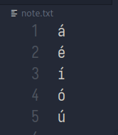

# Linux Quick Accent

Una manera de escribir acentos en equipos con teclado en inglés.



# Instalación

```bash
pip3 install -r requirements.txt
```

# Como se utiliza.

```bash
python3 quick_accent.py
```

Se debe pulsa la combinación de teclas 'vocal+space' del teclado por un tiempo (100 ms) donde `vocal` es cualquire vocal en minuscula "a e i o u".

# TODOs

* Arreglar fallos ocasionales.

* Soporte a mayúsculas.

* Funcione como servicio.
